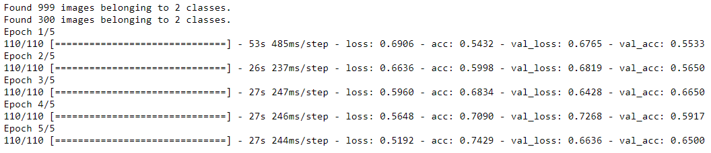
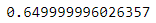
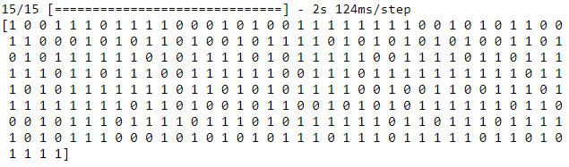
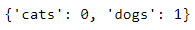
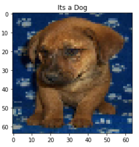

# Image classification using CNN

This is a simple implementation of image classification model using Keras framework and its inbuilt functions. This model classifies whether
the image is a Dog or a Cat.

## Step by step

```python

'''importing the required libraries'''

from keras.models import Sequential
from keras.layers import Conv2D
from keras.layers import MaxPooling2D
from keras.layers import Flatten
from keras.layers import Dense
from keras.preprocessing.image import ImageDataGenerator
from keras.preprocessing import image
import matplotlib.pyplot as plt
import numpy as np
import random
import os
```

The images are stored in the directory in two folders training_set and test_set. These are loaded from the directory using flow_from_directory function.
1000 images were used for training the model and 300 were used for validating the model.

```python

'''Data Preprocessing including Data Augmentation and Training test split '''

train_datagen = ImageDataGenerator(rescale = 1./255,shear_range = 0.2,zoom_range = 0.2,horizontal_flip = True)
test_datagen = ImageDataGenerator(rescale = 1./255)
training_set = train_datagen.flow_from_directory('training_set',target_size = (64, 64),batch_size = 20,
                                                 class_mode = 'categorical')
test_set = test_datagen.flow_from_directory('test_set',target_size = (64, 64),batch_size = 20,class_mode = 'categorical')
```

This model consists of four major steps Convolution, Pooling, Flattening and Full connection. After initializing the sequential layer, 
we made a convolution layer in which we define the arguments, like the size of the image for example. We chose to use an image size of 64 X 64 
to make it more efficient in terms of computational time. The pooling layer is used to reduce the size of the image and restore its important parts 
during this process. The flatten layer converts the pixels into a one dimensional single vector. These vectors act as input to the fully connected layer, 
where we have 128 neurons. We will use a rectifier function as the activation function. We will be using a sigmoid activation function as 
it performs better on binary outputs. We chose Adam as optimizer. It is the advanced version of the Stochastic Gradient Descent (SGD) and is very popular 
when it comes to deep leaning problems. ‘Binary_crossentropy’ was used as loss function given the fact our output is in binary format (0, 1). 

```python

'''Stepwise procedure of creating CNN model'''

# Initialising the CNN
model = Sequential()

# Adding the Convolution layer
model.add(Conv2D(32, (3, 3), input_shape = (64, 64, 3), activation = 'relu'))

# Adding the Pooling layer
model.add(MaxPooling2D(pool_size = (2, 2)))

# Adding a second Convolutional layer
model.add(Conv2D(32, (3, 3), activation = 'relu'))

# Adding a second Pooling layer
model.add(MaxPooling2D(pool_size = (2, 2)))

# Adding the Flattening layer
model.add(Flatten())

# Adding the Full connection(hidden) layers
model.add(Dense(units = 128, activation = 'relu'))
model.add(Dense(units = 2, activation = 'sigmoid'))

# Compiling the model
model.compile(optimizer = 'adam', loss = 'binary_crossentropy', metrics = ['accuracy'])

#Fitting the CNN to the images
model.fit_generator(training_set,steps_per_epoch = 110,epochs = 5,validation_data = test_set,validation_steps = 10)
```



The accuracy largely depends on training the model. As our model was trained with very less images hence we don't expect too high accuracy.
Confusion matrix and classification report can be used to have a better idea of the performance of the model. 
The distinction between Precision and Recall is often key when it comes to business decisions.

```python

''' Evaluation of the model'''
scores = model.evaluate_generator(generator = test_set)
print(scores)
```



```python

'''Prediction of the model'''

test_set.reset()
pred=model.predict_generator(test_set,verbose=1)
pred_class=np.argmax(pred,axis=1)
print(pred_class)
```



```python

''' Convert the labels back to dogs and cats from 0 and 1 '''

labels = (training_set.class_indices)
print(labels)
labels = dict((v,k) for k,v in labels.items())
predictions = [labels[k] for k in pred_class]
```



We test our model on a new image and it classified it correctly. 

```python

''' Testing the model on a new image '''

test_image1 = image.load_img('dog_cat.jpg', target_size = (64, 64))
test_image = image.img_to_array(test_image1)
test_image = np.expand_dims(test_image, axis = 0)
result = model.predict_classes(test_image)
if result == 0:
    name="Its a Cat"
else:
    name="Its a Dog"
    
plt.imshow(test_image1)
plt.title(name)
plt.show()
```


## About Used Dataset
This is a Dogs and Cats dataset for image classification. This file contains 10000 images of Dogs and Cats.

Link : https://www.kaggle.com/chetankv/dogs-cats-images